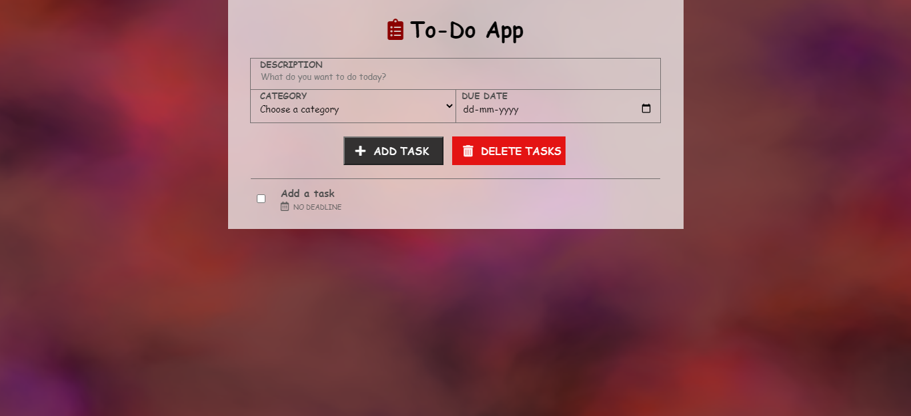
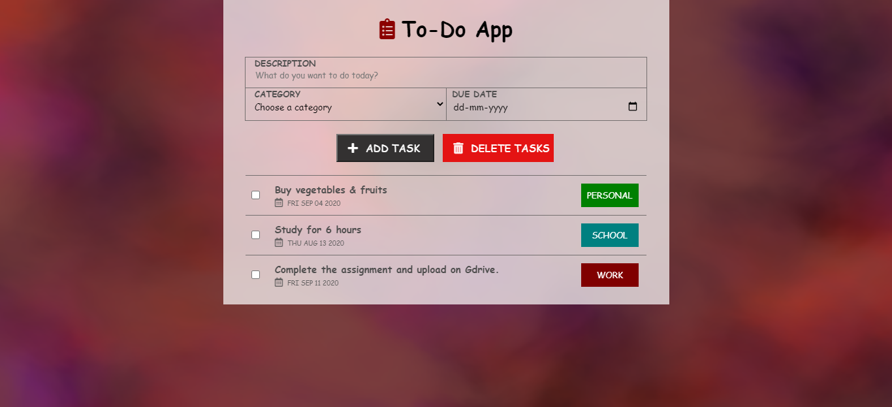
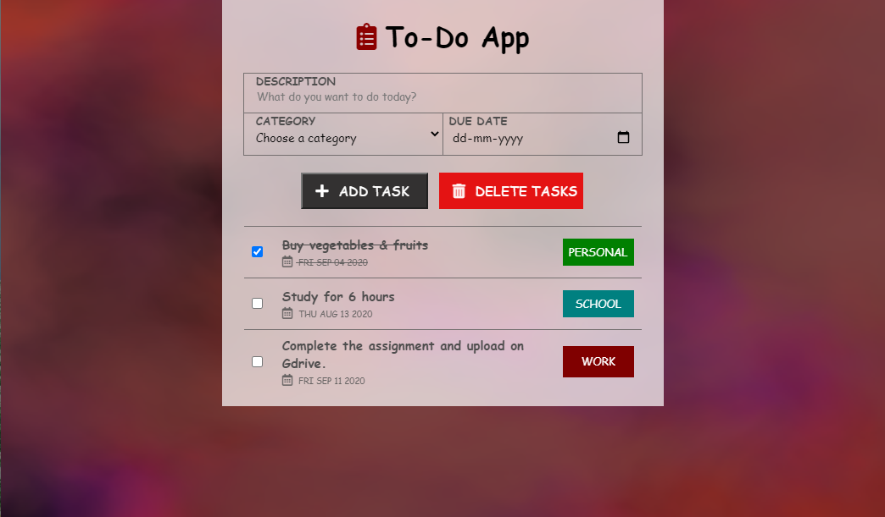
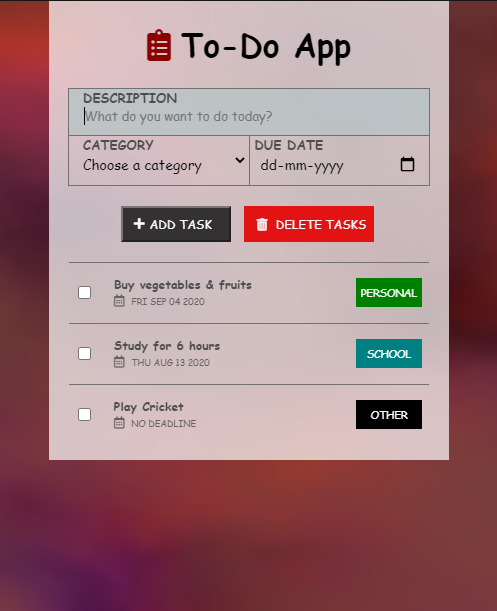

# To_Do_List

 
To-Do List Web App.

# How to Use

1. Install NodeJs (nodejs.org).
2. Fork, Clone and open this repository in a terminal/command prompt.
3. Execute npm install.
4. Execute npm start.
5. Open your preferred web browser and go to https://localhost:8000.

# Features/Functionalities

1. Adding a Task
2. Deleting a Task. (Delete multiple tasks at once)
3. All the tasks are saved to the database (MongoDB)
4. Dynamic background from Vanta JS
5. Responsive App.

# Screenshots

